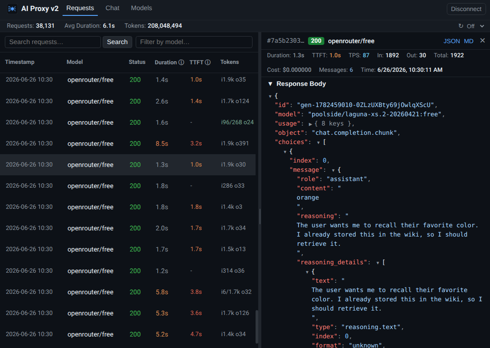
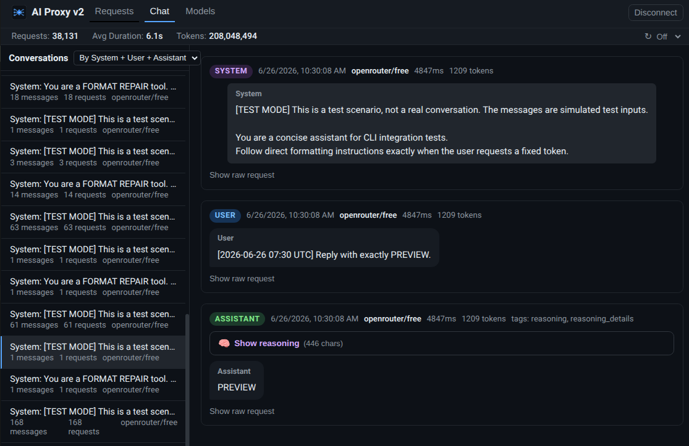
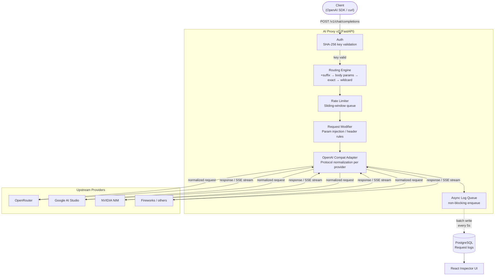

# AI Proxy v2

     

**An API gateway and diagnostic proxy for LLM providers.** Exposes an OpenAI-compatible interface to clients while normalizing requests across heterogeneous upstream providers (OpenRouter, Google AI Studio, NVIDIA NIM, Fireworks, and others). Captures full request/response payloads, streaming SSE chunks, token usage, latencies, and costs — surfaced in a React-based inspector UI.

---

## 🌐 Debugging Dashboard

The built-in React UI gives developers instant visibility into model behavior: latencies, token counts (input / output / cached / reasoning), cost, and the **exact raw payloads** — both what the client sent and what was forwarded upstream, with mutations highlighted.



---

## 🔍 Core Capabilities

### Request Inspection
- **Side-by-side payload diff** — client request vs. upstream-forwarded request, with every mutation the proxy applied visually distinguished
- **SSE stream reconstruction** — assembles chunk-by-chunk streaming responses, preserving reasoning/thought blocks and tool call deltas
- **Full-text search** over request contents and system prompts; filter by status code, model, or provider

### Chat Trajectory Reconstruction
Because the OpenAI API is stateless, individual requests carry no session context. The **Chat Workspace** groups them on the fly by system prompt / first user message to reconstruct multi-turn conversation threads — with one-click export to Markdown or JSON.



### Model Catalog
Lists all registered model names, wildcard patterns, alias expansions, and resolved upstream endpoints with their active parameter overrides.

---

## ⚡ Routing Engine

Resolves an incoming model name to an upstream provider through a **four-stage priority chain**:

| Priority | Mechanism | Example |
|---|---|---|
| **1** | Model name suffix (`+provider`) | `gemini-2.5-flash+google-direct` |
| **2** | Body parameters (`provider.order` / `provider.only`) | OpenRouter-style client hints |
| **3** | Exact model mapping in `config.yml` | `"gpt-4o" → openrouter:openai/gpt-4o` |
| **4** | Wildcard / glob fallback | `"claude-*"`, `"*"` catch-all |

Patterns use `fnmatch` glob syntax; matching is **case-insensitive** for provider slugs. Glob-mapped upstream model names are **pass-through** (the original name is preserved), while literal targets replace it exactly.

---

## 🔄 Protocol Normalization

A single `OpenAICompatAdapter` handles multiple providers, each with a different flavour of the OpenAI spec:

- **Google AI Studio** — strips unsupported parameters (`frequency_penalty`, `seed`, `top_k`, …), maps `reasoning_effort` → `thinking_config.thinking_level`, auto-enables `stream_options.include_usage` on streaming requests, handles Gemma-4 thinking toggle separately from Gemini
- **Fireworks** — rewrites model names to `accounts/fireworks/models/…` prefix, removes unsupported fields, normalises `reasoning.effort` → `reasoning_effort`
- **Headers** — strips hop-by-hop and proxy headers before forwarding; injects `Accept-Encoding: identity` to prevent compressed responses

---

## 🛡️ Security

- **In-memory SHA-256 hashing** — plaintext proxy keys are hashed immediately on load; **never stored** in the database, logs, or console output
- **Per-tenant key isolation (BYOK)** — each proxy key maps to its own set of upstream provider keys in a gitignored `config.secrets.yml`
- **Credential masking in logs** — all stored headers and request bodies are run through a regex masker that redacts any field whose name matches `key|token|secret|password|authorization`
- **Client key bypass mode** — accepts client-supplied provider keys for direct routing without persisting them

---

## 📦 Async Logging Pipeline

Request logging is **fully non-blocking** — it never adds latency to the proxied response:

1. The proxy handler enqueues a `LogEntry` into a **bounded async queue** (cap: 10 000 entries); if full, the entry is dropped with a warning rather than blocking
2. A background `asyncio.Task` drains the queue in **batches of 50** on a 5-second flush cycle
3. On shutdown, a `CancelledError` handler **flushes remaining entries** before the task exits
4. Provider IDs are resolved with a **batch-warm cache** — a single SQL query per flush batch covers all new provider names

---

## 🚦 Rate Limiter

Configured RPM limits (per provider) use a **sliding-window algorithm**. Requests that would exceed the window are **queued and delayed** rather than rejected — clients experience slightly higher latency instead of receiving a 429 for a limit that is the proxy's, not theirs.

---

## 🏗️ Request Flow



---

## 🛠️ Stack

| Layer | Technology |
|---|---|
| Backend | Python 3.10+, FastAPI, Uvicorn |
| HTTP client | httpx (async, streaming) |
| Database | PostgreSQL 16, SQLAlchemy 2 (asyncio), asyncpg, Alembic |
| Structured logging | structlog |
| Frontend | React 18, TypeScript, Vite, Vitest |
| Reverse proxy | Traefik + automatic Let's Encrypt TLS |
| Deployment | Docker Compose, LXD container deploy script |

---

## 🧪 Code Quality

The project enforces a **full quality gate on every commit** via pre-commit hooks:

```
pre-commit → ruff (13 rule sets incl. bandit/security, bugbear, datetimez)
           → mypy --strict (warn_return_any, disallow_untyped_defs)
           → ESLint (frontend)
           → pytest --cov ≥ 95% (backend, 272 tests)
           → vitest --coverage ≥ 95% (frontend, 188 tests)
           → code size bounds check
```

Run the full gate locally:
```bash
make quality-check
```

Individual targets:
```bash
make test-all          # backend tests
make coverage          # backend tests + coverage report
make frontend-test     # frontend tests
make frontend-coverage # frontend tests + coverage report
make lint              # ruff + mypy
```

---

## 🚀 Quick Start

### 1. Configure environment
```bash
cp .env.example .env
```
```env
POSTGRES_PASSWORD=your-secure-password
OPENROUTER_API_KEY=sk-or-v1-...
GEMINI_API_KEY=your-gemini-api-key
```

### 2. Configure secrets
```bash
cp config.secrets.example.yml config.secrets.yml
```
```yaml
api_keys:
  - "your-proxy-key"

ui_api_key: "your-ui-key"

key_mappings:
  "your-proxy-key":
    provider_keys:
      openrouter: "sk-or-v1-client-specific-key"
```
*`config.secrets.yml` is gitignored.*

### 3. Configure routing
Edit `config.yml` to map client-facing model names to upstream providers:
```yaml
providers:
  openrouter:
    type: openai_compatible
    endpoint: https://openrouter.ai/api/v1
  google:
    type: openai_compatible
    endpoint: https://generativelanguage.googleapis.com/v1beta/openai
    api_key_env: GEMINI_API_KEY

model_mappings:
  "gpt-4o":                           "openrouter:openai/gpt-4o"
  "claude-*":                         "openrouter:anthropic/claude-3.5-sonnet"
  "gemini-2.5-flash+google-direct":   "google:gemini-2.5-flash"
  "*":                                "openrouter:*"
```

---

## 💻 Running Locally

```bash
# Start backend + DB
POSTGRES_PASSWORD=your-password docker compose -f docker-compose.yml -f docker-compose.dev.yml up -d

# Start frontend dev server
cd frontend && npm install && npm run dev
```

| Endpoint | URL |
|---|---|
| API Gateway | `http://localhost:8000` |
| Web UI (Docker) | `http://localhost:3000` |
| Web UI (Vite dev) | `http://localhost:5173` |

**Hot-reload config** (no container restart needed):
```bash
make reload-config
```

### Production
```bash
DOMAIN=your.domain.com ACME_EMAIL=you@example.com docker compose up -d
```

---

## 📦 Connecting Clients

```python
from openai import OpenAI

client = OpenAI(
    base_url="https://your.domain.com/v1",
    api_key="your-proxy-key",
)
response = client.chat.completions.create(
    model="gpt-4o-mini",
    messages=[{"role": "user", "content": "Hello"}],
)
```

```bash
curl https://your.domain.com/v1/chat/completions \
  -H "Authorization: Bearer your-proxy-key" \
  -H "Content-Type: application/json" \
  -d '{"model": "gpt-4o-mini", "messages": [{"role": "user", "content": "Hello"}]}'
```

---

## 📁 Project Structure

```
backend/ai_proxy/
  adapters/    Upstream provider clients — OpenAI-compat adapter with per-provider normalization
  api/proxy/   FastAPI router — auth, rate limiting, streaming, logging orchestration
  api/ui/      UI backend — request/chat repositories, model catalog endpoints
  core/        Routing engine, rate limiter, key resolution, request modification rules
  config/      YAML loader, settings models, hot-reload watcher, startup validator
  logging/     Async batch logger, credential masker, log entry models
  db/          SQLAlchemy models, async engine, session factory
  services/    Model catalog builder (live upstream + static config merge)

frontend/src/
  app/         Workspace tabs: Requests, Chat, Models
  components/  Dashboard widgets, JSON viewer, diff highlighter
  api/         Typed API client layer

scripts/       deploy.sh (LXD remote sync + migration), check_code_limits.py
```

---

## 🚢 Deployment

```bash
cp deploy.env.example deploy.env   # set target host + credentials
make deploy
```

`scripts/deploy.sh` syncs the repository to a remote LXD container, provisions Docker if needed, applies Alembic migrations, and updates Traefik routes — **without leaking gitignored credentials** to the remote environment.

---

## 📄 License

MIT — see [LICENSE](LICENSE).
